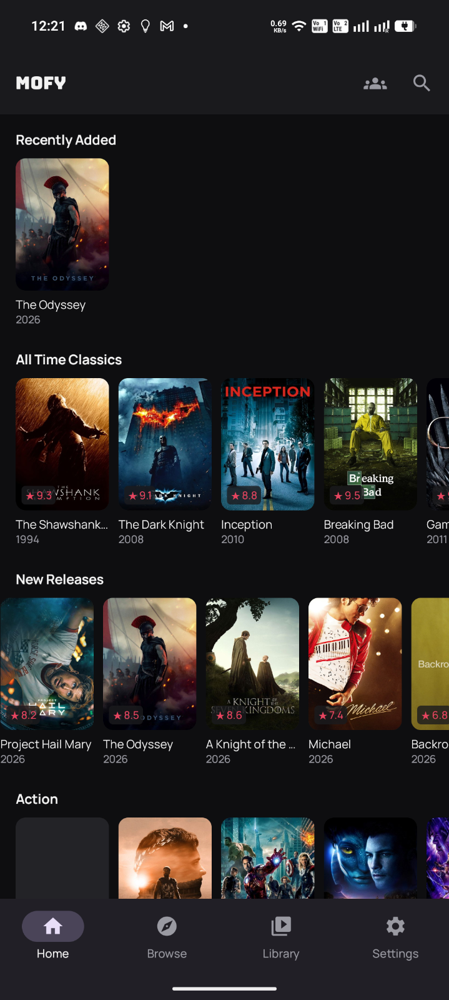
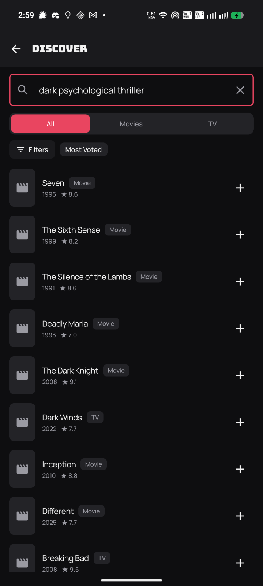

# Mofy

Personal-use Android app for browsing, searching, and watching movies and TV shows.
Dark-only cinematic UI, on-device semantic search via EmbeddingGemma-300m.

## Screenshots

<table>
  <tr>
    <td></td>
    <td></td>
  </tr>
  <tr>
    <td align="center">Browse</td>
    <td align="center">Semantic Search</td>
  </tr>
</table>

## Features

- Catalog browsing with genre, type, and sort filters
- On-device semantic search (EmbeddingGemma-300m + sqlite-vec KNN)
- Facet detection (genre, mood, date, rating) via distilbert ONNX model
- Library management with watch progress tracking
- Watch Together via WebRTC data channel
- libVLC media playback

## Docs

- `docs/adrs/` — architecture decision records
- `docs/research/` — integration notes (LiteRT, sqlite-vec, WebRTC, etc.)
