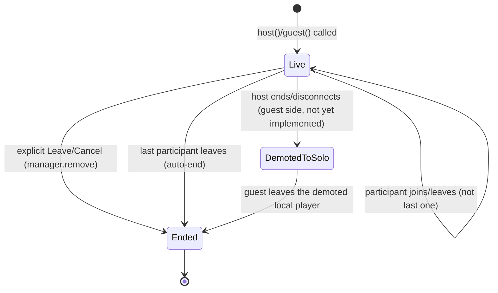

# ADR 0011: Watch Together Session Lifecycle — App-Scoped Pool + Foreground Service

**Status:** accepted and fully implemented — items 1-6 built, plus
demote-to-solo (the redesign doc's `Live → DemotedToSolo` transition):
guests losing their host now emit `SyncEngine.SyncEvent.HostLost` /
`WatchTogetherSession.WtEvent.HostLost` (previously silent - a guest's
one connection to the host had no path to `SyncEngine.handlePeerDisconnected`
since `peerToParticipantId` is only ever populated host-side), which
`SoloPlayerScreen` reacts to by dropping its session reference (falling
back to plain local playback, same code path as solo) and removing the
dead entry from `WatchTogetherSessionManager`. Not yet built: writing the
demoted player's position to watch history on exit - solo playback
doesn't persist progress at all today, so this isn't a regression, but
it means a demoted session's progress is currently lost once the screen
is left, same as any other solo watch.

## Context

Live device testing this session (docs/tasks/watch-together-redesign.md)
surfaced two real bugs, both traced to the same root issue: the pool of
live `WatchTogetherSession` objects has no lifecycle independent of the
UI, despite looking like it does.

- `WatchTogetherSessionViewModel` (`ui/watchtogether/WatchTogetherSessionViewModel.kt`)
  extends Android's `ViewModel`, but is instantiated via
  `remember { WatchTogetherSessionViewModel() }` in `MainActivity.kt`, not
  through the framework's `viewModel()` factory tied to a real
  `ViewModelStoreOwner`. It gets none of what a ViewModel is actually for
  (surviving configuration changes via a managed store) — it's a plain
  `remember`-held object that happens to live as long as the Activity's
  top-level composition does. It only "survives navigation" because
  Compose Navigation swaps out individual route composables while the
  parent composable holding this `remember` stays alive throughout.
- `SoloPlayerScreen.kt`'s `onDispose { newSession?.end() }` (now fixed to
  not do this — see below) additionally coupled session teardown to
  *screen* disposal, so backing out of the player killed the session
  outright, independent of the deeper Activity-lifetime problem.
- Confirmed live: pressing "Start watching" (which used to call
  `session.end()` + create a fresh session on a new random port) dropped
  an already-connected desktop guest — WebSocket closed with code 1001 the
  instant that action fired, and every reconnect attempt after that hit
  the old, now-dead port. Fixed in this session via `SyncEngine.rebindPlayer()`
  (swap the player object in place, keep the same signaling server/port/
  connections alive) instead of tearing the session down.

The WebRTC/signaling layer itself is **not** part of this problem —
`PeerConnectionFactoryHolder` (plain Kotlin `object`, process-wide
singleton, initialized once with `applicationContext`), `HostHub`/
`GuestPeer` (plain classes, own dedicated executor, no Android UI
dependency), and `EmbeddedSignalingServer` are already correctly
decoupled from any View/ViewModel. The problem is entirely in what
*holds* `WatchTogetherSession` instances between screens: a
Compose-remembered object with no real independence from the Activity.

Even with the two live bugs above fixed, sessions still only survive as
long as the Activity's composition is alive — nothing formally protects
the embedded WebSocket server or WebRTC data channel from Android's
background execution limits (Doze, background network throttling) once
the *app itself* (not just the current screen) is backgrounded. This is
the "foreground service" gap already flagged as required, not optional,
in docs/tasks/watch-together-redesign.md.

ADR 0010 already established the pattern for a comparable problem
(model downloads that must survive backgrounding): a plain foreground
`Service`, no WorkManager. This ADR reuses that same, already-verified
pattern rather than re-litigating the WorkManager-vs-Service question.

## Decision

Move the live-session pool out of the Compose-remembered
`WatchTogetherSessionViewModel` into a genuine Application-scoped
singleton (`WatchTogetherSessionManager`), paired with one shared
foreground `Service` that starts when the first session goes live and
stops when the last one ends — keeping the process's networking alive and
exempt from background throttling for exactly as long as any Watch
Together session is active, no longer.

## Task DAG

```
 1 ──► 3 ──► 4
 1 ──► 2 ──► 5
       2 ──► 6
```

1. **`WatchTogetherSessionManager`** (new file,
   `watchtogether/WatchTogetherSessionManager.kt`) — plain Kotlin `object`
   (process-wide singleton, same shape as `PeerConnectionFactoryHolder`),
   holding `MutableStateFlow<List<ActiveSession>>` capped at
   `SessionLimits.MAX_CONCURRENT_SESSIONS`. Same API surface as today's
   `WatchTogetherSessionViewModel` (`add`/`remove`/`removeLast`/
   `sessionFor`/`itemFor`/`sessionStates`/`canAddMore`) — this is a move,
   not a redesign of that API. Depends on nothing.

   ```kotlin
   object WatchTogetherSessionManager {
       private val _sessions = MutableStateFlow<List<ActiveSession>>(emptyList())
       val sessions: StateFlow<List<ActiveSession>> = _sessions.asStateFlow()
       // add/remove/removeLast/sessionFor/itemFor/sessionStates/canAddMore -
       // bodies unchanged from WatchTogetherSessionViewModel.
   }
   ```

2. **`WatchTogetherForegroundService : Service()`** (new file,
   `watchtogether/WatchTogetherForegroundService.kt`) — started via
   `ContextCompat.startForegroundService()` the moment 1's `sessions` flow
   goes from empty to non-empty; stops itself the moment it goes back to
   empty (observes 1's `StateFlow` directly, no polling). One persistent
   notification, collapsed per the redesign doc's spec: "Watching
   together" for 1 active session, "N watch parties active" for more than
   one — tapping it deep-links into the Listing screen
   (`PushedRoute.WT_LISTING`). Depends on 1.

3. **Call-site migration**: every `watchTogetherViewModel.xxx` reference
   in `MainActivity.kt` becomes `WatchTogetherSessionManager.xxx`; delete
   `val watchTogetherViewModel = remember { WatchTogetherSessionViewModel() }`
   and the `WatchTogetherSessionViewModel.kt` file itself. Mechanical
   rename, but touches every call site enumerated earlier in this session's
   multi-session rewrite (topBar closures, `WT_CREATE`/`WT_ROOM`/
   `WT_SESSION`/`WT_LISTING` composables, the always-on `LiveSessionBar`
   block, `JoinSessionSheet`'s `onJoined`). Depends on 1.

4. **Confirm `SoloPlayerScreen.kt`'s `onDispose` stays session-silent**
   (already fixed this session to only call `newPlayer.detachViews()`/
   `release()`, never touch the session) — now provably correct once 1-3
   land, since the manager's lifetime is no longer bounded by the
   Activity's composition at all. Depends on 3.

5. **Manifest + service type**: add `<service>` entry for 2 with
   `android:foregroundServiceType="dataSync"` (same rationale as ADR
   0010 — a live socket/data-channel, not media playback) and confirm
   `FOREGROUND_SERVICE`/`FOREGROUND_SERVICE_DATA_SYNC` permissions are
   declared for the target API level. Depends on 2.

6. **Wire the dead heartbeat**: `SyncEngine.heartbeatTick()` exists
   (`SyncEngineConfig.POSITION_HEARTBEAT_MS = 3_000L`) but nothing calls
   it on an interval today (flagged in the redesign doc's code audit).
   Add a coroutine loop inside 2's service — one per active host session,
   cancelled when that session is removed — ticking every
   `POSITION_HEARTBEAT_MS`. This is the natural home for it now that a
   background-surviving component exists to own the loop. Depends on 1, 2.

## Session lifecycle after this ADR



| Node | Triggering action | Effect |
|---|---|---|
| **`[*] → Live`** | `WatchTogetherSession.host()`/`.guest()` called, then `WatchTogetherSessionManager.add()` | Session registered in the app-wide pool. If this was the pool's only entry (0→1), `WatchTogetherForegroundService` starts (item 2) and posts its notification. |
| **`Live → Live`** | "Start watching" pressed (host) → `rebindPlayer()` | Player object swapped in place on the *same* session. Signaling server, port, and any already-connected guest's WebSocket are untouched (this session's fix — previously this was a `Live → Ended → Live(new)` round-trip that dropped guests and changed the port). |
| **`Live → Live`** | Back/minimize from the Player screen | `SoloPlayerScreen.onDispose` releases only the local `VlcPlayerController` (`detachViews()`/`release()`) — the session itself is never touched here. Re-entering the player later calls `rebindPlayer()` again with a fresh local player, seeked to the session's current position. |
| **`Live → Live`** | App itself backgrounded (not just in-app navigation) | Before this ADR: unprotected, Android can throttle/kill the socket. After: `WatchTogetherForegroundService` is running for as long as `sessions` is non-empty, so the process and its network I/O stay alive; item 6's heartbeat loop keeps ticking inside that service regardless of which screen (if any) is visible. |
| **`Live → Live`** | A participant joins or leaves, but isn't the last one | `SyncEngine` emits `ParticipantsChanged`; `WatchTogetherSessionManager.sessionStates` reflects it; no lifecycle transition. |
| **`Live → Ended`** | User taps Leave (Listing row / Room Screen Cancel / Player Leave) | `WatchTogetherSessionManager.remove(roomKey)` → `session.end()` → transport/signaling actually close this time. If the pool is now empty (1→0), the foreground service stops itself. Host-leave shows the confirm dialog first (already built in `WatchTogetherListingScreen`) since it also ends the room for any connected guest. |
| **`Live → Ended`** | Last remaining participant leaves (any role) | Per the redesign doc's decision: a room with zero participants auto-ends — same effect as an explicit Leave, just triggered by the participant count reaching zero rather than a tap. |
| **`Live → DemotedToSolo`** | Host ends the room, or disconnects, while a guest is still watching | **Not yet implemented** — currently a guest just receives a `WtEvent.Error`/toast and the session dies outright. The redesign doc's decision is to instead swap the guest onto a local, un-synced solo player at the same position, so they can keep watching. |
| **`DemotedToSolo → Ended`** | Guest leaves the demoted solo player | Position is written to watch history (per the redesign doc), so it resumes normally from Home's "Continue Watching" like any other solo watch — not yet implemented, tracked separately from this ADR's lifecycle-pool work. |

## Alternatives considered

- **Minimal fix: keep the pool in the Compose-remembered ViewModel, just
  stop `onDispose` from ending sessions** — already done this session as
  an interim step (item 4 above), but doesn't solve backgrounding: once
  the whole app (not just the screen) goes to background, Android can
  still throttle/kill the socket with nothing protecting it. Necessary
  but not sufficient.
- **WorkManager** — rejected for the same reason as ADR 0010: this is a
  continuously-held live connection, not deferrable/periodic work: wrong
  shape of problem for WorkManager's scheduling model.
  the connection isn't inherently deferrable/periodic — it's a live
  socket that needs to just keep running.
- **One foreground service per session** instead of one shared service —
  rejected in favor of one shared service, since the redesign doc already
  specifies collapsing multiple active sessions into a single notification
  ("2 watch parties active"), which a single shared service does
  naturally; N services would need to coordinate notification collapsing
  across each other for no benefit.

## Consequences

- Sessions survive full app backgrounding (the actual goal), not just
  in-app navigation between screens.
- A second foreground service exists alongside ADR 0010's model-download
  service — independent lifecycles, no conflict, but two notification
  channels to maintain.
- `WatchTogetherSessionViewModel.kt` is deleted; `WatchTogetherSessionManager`
  has no test yet of its own (the existing
  `WatchTogetherSessionViewModelTest.kt` needs porting to the new type,
  though its actual test bodies transfer directly since the API is
  unchanged).
- `MainActivity.kt` gets touched at every current
  `watchTogetherViewModel.*` call site — mechanical, but a real diff
  surface (roughly a dozen sites per the current multi-session
  implementation), worth a careful pass rather than a blind find-replace
  given some sites `collectAsState()` and others read `.value` directly.
- The always-on `LiveSessionBar`/Room-Screen-Cancel "most recently added
  session" fallback (documented as an interim behavior in the redesign
  doc, pending the real Listing screen work) is unaffected by this
  ADR — it's an orthogonal UI-completeness gap, not a lifecycle one.
