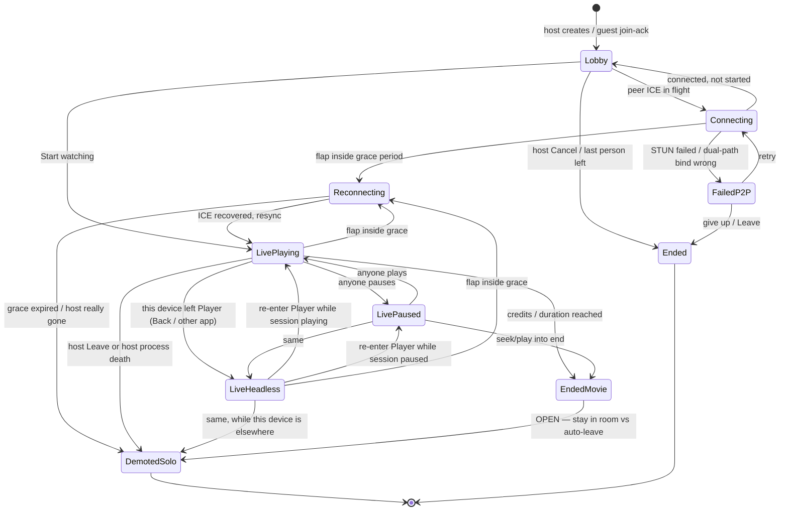

# Watch Together flows — host and guest

Product flow contract for multiplayer watch. Complements (does not replace)
the locked UI/lifecycle decisions in `docs/tasks/watch-together-redesign.md`
and ADRs 0006 / 0011.

- **This file** owns happy/sad paths, presence, network, clock, and
  control-plane behavior, written from **both** host and guest.
- **Redesign doc** still owns screen entry points, Leave vs Back vs Cancel,
  listing hub, session cap, demote-to-solo, and the code audit.
- **State / UX ownership** (room clock vs bookmark, global vs local,
  who saves on Back/Leave) lives in
  `docs/tasks/watch-together-state-and-ux.md`.
- Where they conflict on *screens and teardown*, redesign wins.
- Where they conflict on *sync/clock/network*, this file wins once the
  Open decisions at the bottom are locked.

v1 constraints that every flow below assumes:

- Star topology: host is signaling + DataChannel hub. Guests never mesh.
- No video bytes move. Each device plays its own local file.
- No host handoff. Host gone for real → guests demote to solo.
- No TURN. STUN-only ICE. Some networks will not connect.
- Max 10 people per room, max 4 live sessions on this device.

---

## 1. Roles

| | Host | Guest |
|---|---|---|
| Enters from | Detail → Watch Party / Watch Together | Shared link, QR, or Listing → Join a Room |
| Owns | Room, signaling server, ICE offers, position clock, fan-out | One peer connection to the host |
| Can play / pause / seek | Yes | Yes |
| Can Start watching | **OPEN** (see §13) | **OPEN** (see §13) |
| Leave | Confirm: ends the room for everyone | Immediate: this device only |
| Host process death | Room dies | Demote to solo at last known position |
| Guest process death | That participant leaves; others continue | — |

"Host" is a **transport role**, not a director. Anyone may control playback.
The host phone is still a single point of failure for the *room*.

---

## 2. Shared session states

These are session states, not screens. A device can be in `live-headless`
while showing Library.

| State | Meaning |
|---|---|
| `Lobby` | Room exists. People can join. Playback has not started (unless hot-join; then skip to live). |
| `Connecting` | Signaling ok-ish, ICE not up yet. |
| `FailedP2P` | Could not establish DataChannel. Room may still exist. Do **not** demote to solo — they never synced. |
| `Reconnecting` | Had a live channel, it dropped, grace period running. Freeze local playback; do not emit controls from a dead socket. |
| `LivePlaying` / `LivePaused` | Synced. Local player may or may not be bound. |
| `LiveHeadless` | This device is not rendering. Session still live. Virtual clock on host; guests keep applying remote events without a Surface. |
| `EndedMovie` | Position at / past duration. Room not automatically torn down unless §13 says so. |
| `DemotedSolo` | Guest only. Same file, same position, no sync. Leave writes watch history. |
| `Ended` | Room gone. Link is dead. |

---

## 3. Clock and headless (non-negotiable)

Player `Back` **releases** the local VLC instance. The session must not.

**Rule:** a released / missing player must never emit `play` / `pause` /
`seek` / `position` derived from native player reads. Those reads fail or
lie (`position=0`, `isPlaying=false`) and will rewind or pause the room.

### Host virtual clock

While the host player is unbound and the session is `LivePlaying`:

- Keep `(positionMs, isPlaying, startedAtElapsed)` in session memory.
- Advance `positionMs` from the monotonic clock while `isPlaying == true`.
- Heartbeat broadcasts **that**, not VLC.
- Remote pause/seek still update the virtual clock.
- Re-enter Player → `rebindPlayer()` seeks to the virtual clock, then
  plays or pauses to match `isPlaying`. Never seek to 0.

While `LivePaused`, the virtual clock is frozen.

### Guest headless

Same bind/unbind. Guest does **not** own the clock. They apply host-fanout
events to session memory. Re-enter seeks to last applied state.

### Who is watching vs who is in the room

Presence has two bits per participant:

- `inRoom` — still a member (signaling/datachannel up)
- `rendering` — Player screen bound on that device

Someone who hit Back is `inRoom && !rendering`. They are not "gone."
Listing / lobby / player chrome should be able to show e.g.
`3 in room · 1 watching`.

---

## 4. Control plane (slider wars)

Locked intent: last write wins, anyone may control.

**How it actually has to work** (otherwise dual-network + two sliders
oscillate):

1. **Emit on scrub-end**, or debounce ~150–300ms. Never per-frame.
2. **Host serializes.** Guest controls go to host. Host assigns `seq` +
   `ts` (host clock, not each phone's wall clock). Host fans out one
   event. Originator applies the fan-out too, or applies locally and
   **echo-suppresses** the copy of their own `seq`.
3. **Pending replace, do not queue.** A newer seek while one is in flight
   drops the older one.
4. **Ignore window** ~500ms–1s after applying a remote seek, so the local
   slider and the echo cannot ping-pong.
5. **Heartbeats never override a newer control.** A `position` tick with
   `ts`/`seq` older than the last `play`/`pause`/`seek` is dropped.
6. Tie-break if `seq` equal (should not happen): higher `positionMs` wins.

Device `System.currentTimeMillis()` is not comparable across phones.
`ts` is host-assigned.

---

## 5. Network: flap vs dead vs dual-path

Do not collapse these into "internet dropped."

| Failure | Who | Grace | Outcome |
|---|---|---|---|
| Guest Wi‑Fi blip, seconds | That guest | Yes | `Reconnecting` → resync via `join-ack` / snapshot. Others untouched. |
| Host blip, seconds | Everyone | Yes | Stay in room. ICE restart. **Do not demote.** |
| Host gone past grace (Leave, force-stop, process death, phone died) | Everyone | Expired | Guests → `DemotedSolo`. Room `Ended`. |
| Dual Wi‑Fi + LTE / default-route flip | Often everyone | ICE fail is not host death | `FailedP2P` or `Reconnecting`. Show "couldn't connect — try same Wi‑Fi or a network that allows P2P." Retry. |
| Symmetric NAT, STUN-only fail | Joining guest | n/a | Same P2P error. Room stays for people already in. |
| Host IP/port changed after link was sent | New joiners | n/a | Link is stale. In-room peers may still have DataChannels; **new** joins need live signaling. |

**Grace period** distinguishes host-flap from host-dead. Guests cannot tell
the difference otherwise. **OPEN:** duration (suggested 10–15s).

**Dual-network** is not a permission checkbox. Android can keep both
interfaces up and send ICE candidates on Wi‑Fi while the default route is
LTE. Host embedded signaling advertised a LAN IP that is no longer the
path. Treat as P2P failure + retry, not as Leave.

Reconnect snapshot (host → recovering peer): current
`positionMs`, `isPlaying`, `seq`, participant list. Same shape as hot-join.

---

## 6. Host flows

### H1 — Create, share, wait, start

Happy:

1. Detail → Watch Together / Watch Party.
2. Room Screen. Share link (or QR).
3. Host leaves Mofy for a messenger. Session stays in `Lobby` (headless
   lobby). Foreground service + toast/notification keep it alive.
4. Guest(s) join. Host sees participant rows / join toast even if still
   in WhatsApp (notification). Comes back to Room Screen.
5. Start watching → Player. Already-connected guests are not dropped
   (`rebindPlayer`, same signaling port).

Sad:

| When | What |
|---|---|
| Between share and join, host network dies | Link may be stale. Host reconnects signaling; **re-share** if the bootstrap address changed. Guests who never connected see FailedP2P, not solo. |
| Dual Wi‑Fi + LTE on host | ICE/signaling on the wrong interface. Same FailedP2P. Do not auto-Cancel the room. |
| Guest has no local copy | Host stays in lobby. Guest gets hard fail (see G1). |
| Duration mismatch | Guest refused. Host stays. |
| Room full (10) | Further joins `room_full`. Host unchanged. |
| Host Cancel before anyone joins | Room `Ended`. Confirm not required if 0 guests? Redesign: Cancel is teardown; host-leave confirm is required **once guests exist**. **OPEN** for empty room. |
| Host Back in lobby | Room stays. Toast / Listing / notif to return. |

### H2 — Host leaves the Player while others watch

Happy:

1. Watching together.
2. Host taps Back (in-app) **or** goes to another app.
3. Local VLC released. Others **keep playing or stay paused** — whatever
   the session was. Host does not emit a pause.
4. Host browses library / takes a call / whatever.
5. Returns via Listing row **or** notification.
6. Auto-seek to live session state (playing, paused, or ended).

Sad:

| When | What |
|---|---|
| Host force-stops / process killed | Room dies. Guests demote to solo. Link dead. |
| Recents swipe | OEM-dependent. FGS **should** keep the process. If it does not, same as kill. |
| Host phone call / audio focus | **OPEN:** local duck/pause vs room pause. Default recommendation: **local only** unless the user hits pause. Do not pause the girlfriend because the host got a call. |
| Screen off | Stop rendering; virtual clock keeps the session state. Audio **OPEN** (suggested: keep audio if still "watching", mute if headless-from-Back). |
| Movie ends while host is gone | Return lands on `EndedMovie`, not mid-film. |
| Heartbeat from released player | Forbidden. Use virtual clock (§3). |

Host kill is **not** recoverable as the same room. Host comes back →
creates a **new** room. Guests already solo. No zombie code.

### H3 — Host starts or joins another room

Happy:

1. Host Back from Player A (A stays live-headless, virtual clock).
2. Detail of another title → Watch Party, **or** accept an invite as guest
   of room B.
3. Listing shows both. Cap 4.
4. Switch = bind Player to that room's live position. The other room stays
   in sync **silent**.

Sad:

| When | What |
|---|---|
| Two rooms `isPlaying` | Only the **foreground** player makes sound. Background rooms do not pause unless the user pauses them. |
| Host of A is now rendering B | Host of A is headless. A's guests must keep watching. Virtual clock on A. |
| Cap of 4 | Cannot create/join another until Leave. Clear error. |
| Same title, two rooms | Allowed. Listing distinguishes by room code + people, not just poster. |
| Invite to a room this device is already in | Focus that row / that Player. Do not duplicate the session. |
| 1-session notification vs N | 1 → that Player. N → Listing. Never the wrong movie. |

### H4 — Slider fight

Same as guest G4. Host serializes. Debounce on emit. Ignore window on
apply. Heartbeats lose to newer controls.

Host-specific: if the host is headless, they are not dragging a slider.
Remote seeks still update the virtual clock so they re-enter at the
trolled position. That is correct.

---

## 7. Guest flows

Guest never needs Detail → Watch Party. Persona 5 opens a link.

### G1 — Receive link, join, wait, watch

Happy:

1. Tap link / scan QR / paste on Listing.
2. App cold start or already running → join handshake.
3. Local copy found, duration ok → Lobby (`Waiting for host`) **or**
   hot-join straight into Player if already started.
4. Host (or whoever §13 allows) starts → Player at `join-ack` position.

Sad:

| When | What |
|---|---|
| No local copy | Hard fail. Stay out. Do not create an empty player. Copy: they need this title in their library. |
| Duration off by > ~10 min | Refuse. Different cut. Clear error. |
| Already started | Hot-join. Skip lobby. Seek immediately. |
| Host still in WhatsApp | Fine. Lobby waits. Join toast on host. |
| P2P fail | FailedP2P + retry. Not solo. |
| Room full | `room_full`. |
| This device already in 4 sessions | Cap error. |
| Link after host Cancelled / room Ended | Dead link. |
| Link after host network changed | Dead bootstrap. Retry / ask for a new share. |
| Guest network drop in lobby | Reconnecting. Do not show the movie as solo. |

### G2 — Guest leaves Player, comes back

Mirror of H2 with different Leave semantics.

Happy: Back → others continue → return via Listing or notif → live
position.

Sad:

| When | What |
|---|---|
| Guest kills app | That guest leaves the room. Others continue. Guest is **not** demoted-to-solo in the room sense — they are gone. Relaunch: they must join again (same link if room still live) → hot-join. |
| Host dies while guest is in another app | Headless guest → `DemotedSolo` in memory, notification: "you're watching alone." Opening the notif/Listing row opens solo Player at last position. |
| Guest Leave (intentional) | Confirm **not** required. Others keep going. |

### G3 — Guest in two rooms / invited while watching

Same multi-session rules as H3. Guest of A can become guest of B, or
even host of B from Detail, until cap 4.

Leaving B does not leave A.

If they are only a guest and they Leave A, A continues without them.

### G4 — Slider fight

Identical control plane to H4. Guest emits debounced seek; host
serializes; guest applies fan-out.

If guest is offline (`Reconnecting`), local slider is either locked or
local-only until resync — **OPEN**. Recommendation: lock controls while
reconnecting so they do not think they are scrubbing the room.

---

## 8. Start watching, late join, zero guests

Three product choices — **OPEN**, pick one:

| Option | Behavior |
|---|---|
| A. Host-only, need ≥1 guest | Current redesign mermaid. Solo watch uses Detail → Play, not this room. |
| B. Host-only, 0 guests allowed | Host can start alone; friends hot-join later. Matches "share, switch to WhatsApp, start anyway." |
| C. Anyone can start | First Start watching flips Lobby → Live. Need a rule so two people tapping it do not recreate the session (they must not — `rebindPlayer` on existing session). |

Hot-join after start is required regardless of A/B/C.

Starting must **never** tear down signaling or change the port. That
already dropped a live guest once.

---

## 9. Buffering and drift

Phase 13: host heartbeat corrects drift. v1 correction is a hard seek
(redesign: acceptable until janky).

**OPEN:** pause-everyone-on-stall vs snap-back.

Recommendation for v1: **snap-back**. One phone buffering must not freeze
the room. Optional presence bit `buffering` so people know why someone
skipped.

Do not treat a stall as Leave.

Different encodes / intro-skip / runtime within the 10-minute gate will
still feel slightly off. Heartbeat is the mitigation. There is no
frame-accurate v1 promise.

---

## 10. Movie ended

Someone reaches duration (or seeks to end).

**OPEN:**

- Stay in `EndedMovie`, paused at end, room still live (replay / scrub
  back still synced).
- Auto-Leave / auto-end room.
- Credits sit, then toast "movie ended."

Until locked: treat as `LivePaused` at duration. Do not demote. Do not
kill the room. Host Leave still kills.

---

## 11. Interruptions (both roles)

| Event | Room | Local |
|---|---|---|
| In-app Back from Player | Unchanged | Unbind player, headless |
| Other app (WhatsApp, etc.) | Unchanged | Headless if Player not visible |
| Notification tap | Unchanged | Bind Player to that room's live state |
| Incoming call / alarm | Unchanged unless user pauses | Audio focus local; see H2 OPEN |
| Headphones disconnect | Unchanged unless user pauses | Local pause recommended, **not** room pause |
| Screen rotation / fold | Unchanged | Rebind Surface, same position |
| Notification permission denied | FGS may be flaky on some OEMs | Warn; session still tries |
| Battery saver / OEM kill | May equal host death | Demote guests if host; guest leave if guest |

---

## 12. Notifications

- First session live → start `WatchTogetherForegroundService`.
- Last session ended → stop it.
- 1 active session: persistent notif, tap → that Player (or Room if
  still lobby). Redesign also wanted media-style play/pause/seek on the
  single-session notif — keep that; those controls are **room** controls
  (they fan out), not local-only.
- N sessions: one collapsed notif ("N watch parties active") → Listing.
- Join while host is backgrounded: heads-up / update the ongoing notif
  ("X joined").
- Host died while guest headless: "You're watching alone" → solo Player.

---

## 13. Listing, Leave, last person

- Listing is the hub for every session this device is in (host or guest).
- Row tap: host+lobby → Room Screen; else → Player (or solo if demoted
  and still showing — demoted rows should not look like a live party).
- Guest Leave: immediate, others continue.
- Host Leave: confirm *"End party for everyone? Guests will continue
  watching alone."* Then guests demote, room Ended.
- Last participant leave (any role) → room auto-ends.
- Empty room after everyone left is not a joinable zombie.

---

## 14. Join handshake (guest)

Order:

1. Parse room code / link.
2. Cap check (4 sessions on this device).
3. Resolve `itemHash` against local library.
4. Open signaling to host bootstrap.
5. ICE / DataChannel.
6. `join` with `itemHash` + `durationMs`.
7. Host: room_full / hash mismatch / duration mismatch / `join-ack`.
8. Ack carries `positionMs`, `isPlaying`, participants, `seq`.

Failures are terminal for **this attempt**, not for the host's room.

---

## 15. Open decisions (do not implement as if locked)

1. Who can tap Start watching, and can it start with 0 guests? (§8)
2. Grace period length before host-dead demote. (Suggested 10–15s)
3. Pause-all-on-buffer vs snap-back. (Suggested snap-back)
4. Movie-ended: stay paused in room vs auto-end. (Suggested stay paused)
5. Audio while headless / screen off / headphones unplug / incoming call:
   local vs room. (Suggested all local unless user hits pause)
6. Controls while `Reconnecting`: locked vs local-only. (Suggested lock)
7. Empty-lobby Cancel: confirm or not.
8. Single-session notification: transport play/pause/seek as room
   controls (recommended yes, already in redesign).

---

## 16. Flow coverage matrix

| Scenario | Host | Guest |
|---|---|---|
| Share link, leave to messenger, come back | H1 | G1 (join while host backgrounded) |
| Dual Wi‑Fi + LTE / P2P fail | H1 sad | G1 sad |
| Start watching without dropping lobby peers | H1 | G1 hot-join |
| No local copy / duration mismatch | lobby stays | hard fail |
| Back from Player, others continue | H2 | G2 |
| Return via Listing / notif to live position | H2 | G2 |
| Movie ended while away | H2 | G2 |
| Force-stop | kills room | that guest leaves; if **host** died, others demote |
| Host dies while guest in another app | — | G2 sad, notif solo |
| Host returns after kill | new room only | already solo |
| Second room / switch | H3 silent background | G3 |
| Cap 4 / already in that room | H3 sad | G3 |
| Slider trolling | H4 serialize | G4 emit debounce |
| Buffering stall | §9 | §9 |
| Phone call, headphones, rotation | §11 | §11 |
| Room full, dead link, last-leaver | §13–14 | §13–14 |
| Presence in-room vs rendering | §3 | §3 |
| Virtual clock, no false pause | §3 | §3 |

---

## 17. What this file deliberately does not do

- Host handoff / leader election — deferred (`docs/research/watch-together-host-resilience.md`).
- TURN / relay — ADR 0006 v1 no.
- Syncing subtitles or audio tracks — per-device.
- File transfer if the guest lacks the movie.
- Claiming process-death survival without a foreground service.
