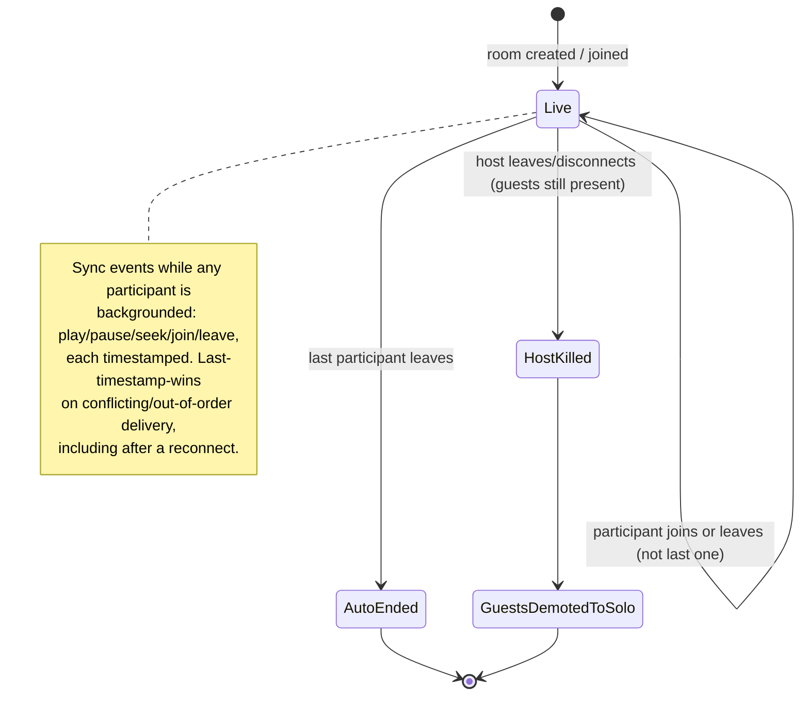
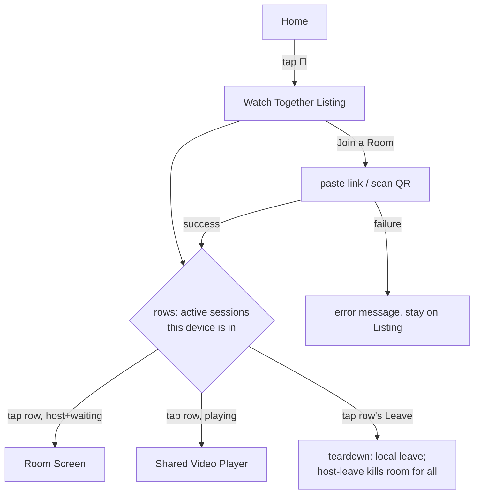

# Watch Together redesign — flows to build against

Supersedes the UI implied by `design/watch-together-mockup.html` where it
conflicts with this doc (the mockup's single-back-arrow-does-everything
Room screen, and its lack of a listing/hub screen, are both wrong per the
decisions below). Source of truth for **screens, teardown, and the code
audit** is this file until code matches it.

Host + guest happy/sad paths, clock, network, and control plane live in
`docs/tasks/watch-together-flows.md`. That file does not relitigate the
locked decisions below. Open decisions at the bottom of the flows doc
are still unlocked.

## Decisions locked in this pass

- Host entry point is **Detail only** (`Watch Party` button on a specific
  item) — never Home.
- Home's 👥 icon opens the **Watch Together Listing** — a hub screen, not
  a single-session pill. Lists every session this device currently
  participates in (host or guest), plus "Join a Room" (paste link / scan
  QR).
- A session row's `Leave` is the only teardown control there is — no
  separate host-only "End". Host leaving is **not gentle**: it kills the
  room for every connected guest immediately (signaling is hosted on the
  host's device, so there's no graceful handoff yet — deliberately
  deferred, see Open questions).
- A room with zero participants auto-ends.
- Room Screen (host, pre-play) gets **two distinct controls**: `Back`
  (backgrounds it, session stays alive, toast shows) and `Cancel`
  (actually ends it — fires the same teardown as a Listing `Leave`,
  before anyone joined).
- Player screen `Back` is real navigation (last history item / Home), not
  a minimize. Leaving the Player screen does **not** pause anything for
  anyone — audio/video just stops rendering locally; the departed device
  keeps syncing state in the background (play/pause/seek events,
  participant join/leave) so it can rejoin mid-position. Anyone still
  actually watching can pause/seek and that still propagates normally.
- Conflict resolution on reconnect / concurrent events: **last-timestamp
  wins**.
- If the host ends the room (or disconnects) while a guest is mid-watch,
  the guest's Player is **demoted to a local solo player** — same
  media, same position, un-synced — rather than being hard-kicked to a
  dead screen. When the guest leaves that demoted player, the watch
  session is written to history at the position it ended, so it
  reappears in Home's "Continue Watching" like any other solo watch.
- Concurrent session cap: **max 4** active sessions per device
  (host+guest combined).
- Room ID generation must be salted by device unique id + timestamp
  nanos, not just `Random.Default`, so two devices creating rooms in the
  same tick can't collide.
- Notification frames from the old mockup (system notif on join, ongoing
  media notif) are kept.

## Requirements added this pass (from background-execution / drift review)

Checked against current code — none of these four are done yet, despite
some scaffolding existing. Treat as required, not optional:

- **Foreground service + notification is mandatory**, not just "kept from
  the mockup." Without it, Android throttles/kills the background
  sync (WebSocket signaling + WebRTC data channel) within seconds of
  `Back`, breaking the "keeps syncing headless" decision above outright.
  One session backgrounded → standard media-style notification
  (play/pause/seek). Multiple backgrounded (cap of 4) → collapse to a
  single persistent notification ("2 watch parties active") deep-linking
  to the Listing screen — never one notification per session.
- **Host-leave needs a confirm dialog**, everywhere it's reachable (Room
  Screen `Cancel`, Listing row `Leave`, Player `Leave`) — since host-leave
  is deliberately "not gentle" (kills the room for connected guests), a
  bare tap must not be able to trigger it. Copy: "End party for
  everyone? Guests will continue watching alone." Guest-leave (doesn't
  affect others) does not need this dialog.
- **Heartbeat drift correction exists but is dead code.**
  `SyncEngine.heartbeatTick()` and the 3s/1500ms constants in
  `SyncEngineConfig.kt` are implemented and correct, but nothing calls
  `heartbeatTick()` on an interval anywhere in production — it needs a
  host-side coroutine loop (`POSITION_HEARTBEAT_MS`) actually driving it.
  The current correction is a hard `seekTo()`, not a smoothed/invisible
  one — acceptable for v1, revisit only if it's visibly janky in
  testing.
- **Duration check on join is missing entirely.** `ItemHash.of()`
  (`ItemHash.kt:24`) hashes only `tmdbId + mediaType + title` — two
  different cuts/re-encodes of the same title with different runtimes
  currently join with no check. Add `durationMs` to the join handshake
  and reject (clear error, not a crash) if the guest's local file's
  duration differs from the host's by more than ~10 minutes.

## Code audit — what exists vs. what this redesign needs

Read-only pass over `watchtogether/` and `ui/watchtogether/`, compared
against the flows above.

**Already solid, no change needed**
- `RoomKey.generate()` (`SessionModels.kt:35`) — 6-char code, 32-symbol
  alphabet, `Random.Default`, ~30 bits of entropy. Correcting an earlier
  assumption in this doc: device-id/timestamp-nanos salting is not
  actually needed — at this app's scale, collision probability is already
  negligible, and salting a *human-typed* 6-char code would fight the
  "short code you can read over the phone" requirement. No change here.
- `WatchTogetherSession.end()` (`WatchTogetherSession.kt:66`) already does
  full teardown (`engine.close()`, `transport.close()`, `signaling?.close()`)
  — one clean path to reuse for both Listing-row `Leave` and Room Screen
  `Cancel`.
- `LiveSessionBar.kt` already has an `onStop` control (Close icon, ends
  the session outright) separate from tap-to-return — the interaction
  split we want (return vs. end) already exists, just scoped to one
  session instead of a list.
- `JoinSessionSheet.kt` already implements the picker → code entry →
  connecting → failed states close to spec (mockup 2a-2d).

**Listing/hub screen — DONE**
`WatchTogetherListingScreen.kt` (new) lists every row from
`WatchTogetherSessionViewModel.sessions`, cross-referenced against
`sessionStates` for live participant count / playing status. Home's 👥
icon now navigates to `PushedRoute.WT_LISTING` instead of opening
`JoinSessionSheet` directly; the Listing's "Join a Room" button is what
opens that sheet now. Row tap routes to `WT_ROOM` (a new route that
resumes an *existing* host session's waiting room — `WT_CREATE` always
creates a fresh session, so reusing it here would double up signaling)
when host+not-yet-playing, otherwise to `WT_SESSION`. Leave is per-row;
leaving as host shows the "End party for everyone? Guests will continue
watching alone." confirm dialog (per the host-leave requirement above),
guest leave fires immediately.

Not yet replaced: the always-on floating `LiveSessionBar` and Room
Screen's Cancel still use "most recently added session" as their target
instead of routing through the Listing — acceptable while 0-or-1 session
is the common case, but worth revisiting once multi-session is actually
exercised in practice.

**Blocking architecture gap: single-session model — DONE**
`WatchTogetherSessionViewModel` now holds `StateFlow<List<ActiveSession>>`
(capped at `SessionLimits.MAX_CONCURRENT_SESSIONS = 4`), keyed by
roomKey (`add`/`remove`/`removeLast`/`sessionFor`/`itemFor`/`sessionStates`).
`WT_SESSION`'s route is now `watch_together/session/{roomKey}`
(`PushedRoute.wtSession(roomKey)`) instead of a single fixed route, and
every call site that used to read "the" session now looks up its
session by roomKey. Detail's pill matches by `itemHash` against
`sessionStates` (a session per active room, not one global session).

Not yet built on top of this: the Listing screen itself. Until it
exists, the always-on floating bar (`LiveSessionBar`) and Room Screen's
Cancel button fall back to "the most recently added session"
(`removeLast()` / `sessions.lastOrNull()`) as an interim behavior — correct
for the common 0-or-1-session case, but not a real multi-session UI.
That's the next piece of work.

**SoloPlayerScreen vs. PlayerScreen (Watch Together's player)**
Two separate files, comparable size (`SoloPlayerScreen.kt` 329 lines,
`PlayerScreen.kt` 320 lines) — confirmed still fully duplicated, as
flagged by the earlier fork. `SoloPlayerScreen` has this session's
subtitle-track picker (CC button + dropdown) and gesture/centered
play-pause layout that `PlayerScreen` never received. Given the new
"demote host-ended guest to local solo player" requirement, these two
now need to *interoperate* at minimum (demotion has to hand off from a
synced `PlayerController` to a plain local one without a jarring
screen swap) — worth deciding whether to merge them into one composable
parametrized by "synced vs. solo" before building the demotion path, vs.
duplicating the demotion logic into a still-separate `PlayerScreen`. My
read: merge now, since the demotion requirement makes the duplication
cost concrete instead of hypothetical — but this is a real scope call,
not a small thing to decide by default.

**Confirmed missing (already listed above, restated for the audit)**
No foreground service, no host-leave confirm dialog, no scheduled
heartbeat, no duration check at join. All four need new code, not
wiring existing pieces together.

## Open questions (deferred, not blocking)

- Host handoff (promote a guest to host without killing the room) — not
  in this pass, noted for later.
- Exact multi-session concurrency model: does each active session need
  its own live `WatchTogetherSession`/signaling client/WebRTC peer
  running simultaneously, or can non-foregrounded sessions be
  suspended/reconnected lazily? Affects whether the cap-of-4 is a hard
  resource cap or just a UI/list-length cap.

---

## Host flow

```mermaid
stateDiagram-v2
    [*] --> Detail
    Detail --> RoomScreen: tap "Watch Party"

    state RoomScreen {
        [*] --> Waiting
        Waiting --> Waiting: guest joins (toast, participant row added)
    }

    RoomScreen --> Detail: Cancel (ends room, 0 guests so far)
    RoomScreen --> Backgrounded: Back (room stays alive)
    RoomScreen --> Player: Start watching (>=1 guest ready)

    Backgrounded --> RoomScreen: tap "N live sessions" toast (1 session)
    Backgrounded --> Listing: tap toast (>1 session)

    Player --> PlayerBackgrounded: Back (real nav; keeps syncing headless)
    Player --> Ended: Leave (kills room for all guests)
    PlayerBackgrounded --> Player: return via Listing row
    PlayerBackgrounded --> Ended: Leave from Listing row

    Ended --> [*]
```

## Guest flow

```mermaid
stateDiagram-v2
    [*] --> Home
    Home --> Listing: tap 👥
    [*] --> Listing: open shared link / scan QR (share sheet, or app cold start)

    Listing --> JoinSheet: "Join a Room"
    JoinSheet --> Connecting: paste link / scan QR
    Connecting --> NoLocalCopy: title not in library (hard fail)
    Connecting --> Lobby: local copy found, joined

    NoLocalCopy --> Listing: dismiss

    state Lobby {
        [*] --> WaitingForHost
    }

    Lobby --> Player: host starts watching
    Lobby --> Listing: Leave (before host starts)

    Player --> PlayerBackgrounded: Back (real nav; keeps syncing headless)
    Player --> Listing: Leave (this device only, others continue)
    PlayerBackgrounded --> Player: return via Listing row

    Player --> SoloDemoted: host ends / host disconnects
    PlayerBackgrounded --> SoloDemoted: host ends / host disconnects (headless)
    SoloDemoted --> History: guest leaves solo player (position saved)
    History --> Home: appears in Continue Watching
```

## Session lifecycle (either role, cross-cutting)

## Listing screen (hub)

