# Watch Together — UX, side effects, global vs local state

First-principles model of *what the user is doing*, *what else that
touches*, and *which memory is allowed to hold it*. Complements
`watch-together-flows.md` (happy/sad paths), `watch-together-redesign.md`
(screens / Leave vs Back), ADRs 0006 / 0011.

If this file and the session snapshot in `WatchTogetherSession` disagree,
this file is the intended model.

---

## 0. First principles

1. **Each phone plays its own file.** The room only shares *time and
   intent* (play / pause / seek), never frames.
2. **A room is not a bookmark.** “Where the party is” ≠ “where I left
   this movie last Tuesday.” Mixing them rewinds Continue Watching or
   fights the slider.
3. **Back is not Leave.** Back stops *this device rendering*. Leave
   changes *membership*. Killing the host process destroys the room.
4. **The host phone is infrastructure**, not a director. Anyone may
   control playback. If that phone dies, there is no room (v1, no handoff).
5. **Bound player is a renderer**, not the clock. While a Surface exists,
   VLC is how we *paint*. The clock lives in the session. When VLC is
   released, it must not be asked “where are we?”
6. **One writer per sink.** Room clock has one owner. Library bookmark
   has one writer per (device, item) at a time. UI scrub has one owner:
   the finger.

---

## 1. The objects (semantic)

| Object | Meaning | Lifetime |
|---|---|---|
| **Library item** | This device’s copy of a title | Until deleted |
| **Bookmark** (`lastPositionMs`) | Where *I* should Resume | Survives app death |
| **Room** | A live party for one `itemHash` | Until Leave / host death / last person |
| **Room clock** | Shared playhead + paused/playing | Dies with the room |
| **Membership** | Who is in the room | Signaling / DataChannel up |
| **Rendering** | This device has a Player Surface | Player composable bound |
| **Control seq** | Host-assigned order of play/pause/seek | In-memory, not SQLite |

A device can be **in the room and not rendering** (Back, other app).
That is still “watching together.” Audio/video just aren’t on this
screen. The girlfriend’s phone does not pause.

---

## 2. Global vs local state

**Global** = process-wide, survives navigation, one per live room (or
one per library item for bookmarks).  
**Local** = this screen, this gesture, this player instance. Must not
leak into the room or the DB as truth.

### Global (session / app)

Owned by `WatchTogetherSessionManager` + `SyncEngine` (the store), and
SQLite for bookmarks.

| State | Owner | Who reads | Who writes |
|---|---|---|---|
| Pool of live rooms (max 4) | SessionManager | Listing, FGS, pills | create / join / Leave |
| Room key, role, itemHash | SyncEngine / session | Invite, join handshake | Once at create/join |
| Room clock `positionMs`, `isPlaying`, anchor | **SyncEngine only** | UI, FGS bookmark copy, heartbeats, join-ack | Controls + heartbeat extrapolate |
| Participants | SyncEngine | Listing, lobby, toasts | join / leave / disconnect |
| Control `seq` / last applied | SyncEngine | Ignore window, stale Position drop | Host on fan-out |
| FGS running | 0↔N sessions | Android | Manager |
| Bookmark `lastPositionMs` | `library_items` | Home Continue Watching | **See §5** — not the engine |

Heartbeat **broadcast** (network) stays ~3s. Local **store ticks** for a
live toast may be faster and must **not** send `Position` frames.

### Local (this device / this screen)

| State | Owner | Must not |
|---|---|---|
| VLC instance, Surface, attach/detach | Player screen | Be the room clock; be read after `release()` |
| Slider value **while dragging** | Compose | Emit per-frame seeks; write DB |
| Subtitle / audio track | This player | Sync to others (`pref` is local) |
| “Connecting / Failed P2P / Reconnecting” chrome | This device’s transport | Demote the room on ICE fail |
| Volume, mute, brightness | Device | Pause the room |
| Which room is **audible** (max 4) | This device | Pause background rooms on switch |

### Never global

- Released VLC `position=0` / `isPlaying=false`
- Mid-scrub slider
- seq / “how far we applied sync” as a library column
- Guest’s old solo bookmark as the room clock

---

## 3. UX flows and what they move

### A. Solo watch (no room)

User: Play on Detail → watch → Back.

- Clock = VLC.
- Bookmark: Player screen periodic + flush on dispose.
- No session, no FGS, no heartbeats.

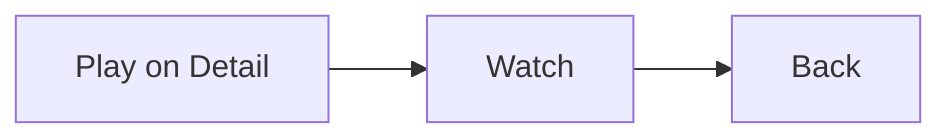

### B. Host creates, shares, waits, starts

User: Detail → Watch Together → share link → maybe WhatsApp → Start.

- Room enters the **global pool** at create. FGS starts (0→1).
- Invite URL is signaling reachability (LAN IP today). STUN is **not**
  the invite. AP isolation ⇒ guest never even signals.
- Start watching **rebinds** a real player onto the **same** session
  (same port). Must not mint a new room.
- Room clock starts when playback starts (or stays 0/paused in lobby —
  OPEN: start with 0 guests).

Side effects: Listing row, notification, Detail pill for that
`itemHash`. Bookmark: do **not** write until they’re actually playing
(or on Leave). Lobby-at-0 must not smash a 40-minute solo bookmark.

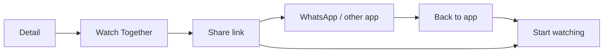

### C. Guest joins (link / QR / paste)

User: open link → local copy? duration? → lobby or hot-join.

- Join handshake is global (room membership).
- Failures (no copy, duration, room full, P2P) are **local chrome**.
  Room stays up for people already in. `FailedP2P` ≠ Leave ≠ HostLost.
- Hot-join: apply join-ack to **room clock on this device**, then
  render. Bookmark write starts only once they’re in and playing.

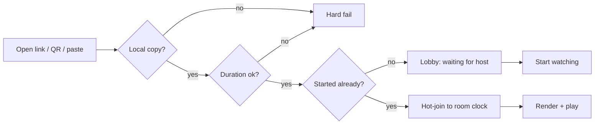

### D. Anyone play / pause / seek

User: tap pause, scrub, nudge.

- **Local:** slider while dragging.
- **On scrub-end / debounce:** `localSeek` → host serializes → fan-out
  → every engine store updates. Originator echo-suppressed.
- Bookmark: FGS copies room clock later, not per-frame.

Side effects: every rendering player seeks; headless members only
update the store (toast/Listing time can tick).

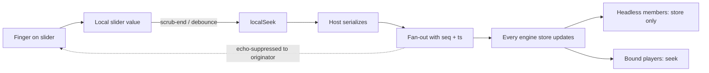

### E. Back from Player (in-app) or Home / other app

User: not leaving the party.

- **Local:** release VLC. Stop painting. Stop the screen’s DB loop.
- **Global:** room stays. FGS keeps heartbeat + bookmark copy from
  **engine store**, never from the dead player.
- Others keep playing. This device is `inRoom && !rendering`.
- Return via Listing or notification: `rebindPlayer` from store
  (position + paused/playing). Never seek 0.

If `onDispose` writes VLC (or 0) into the bookmark here, Continue
Watching lies. That write is forbidden for WT.

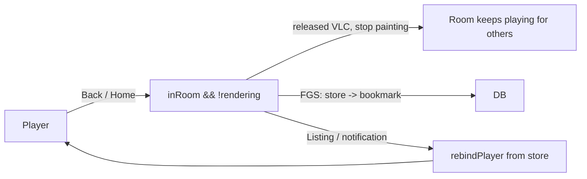

### F. Switch rooms / second Watch Party

User: Back, start or join another room (cap 4).

- Global: two (or more) engine stores. One FGS.
- Local: **one audible player**. Background rooms stay in sync
  **silent**. Switching does **not** pause room A unless they hit
  pause.
- Bookmark: FGS writes **each** room’s item from that room’s clock.
  Same title, two rooms → one library row, last write wins. Don’t
  invent per-room SQLite.

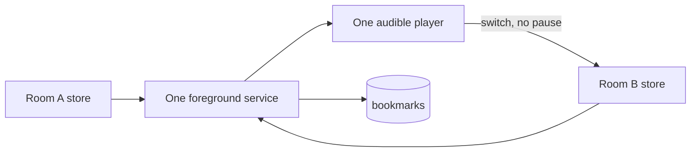

### G. Leave

- **Guest Leave:** this device drops membership. Flush **this** room
  clock → **this** item’s bookmark once. Others continue. If pool 1→0,
  FGS stops.
- **Host Leave:** confirm. Room dies. Every guest demotes to solo at
  last room clock. Each device flushes that position to its own
  bookmark, then solo owns the player + DB.

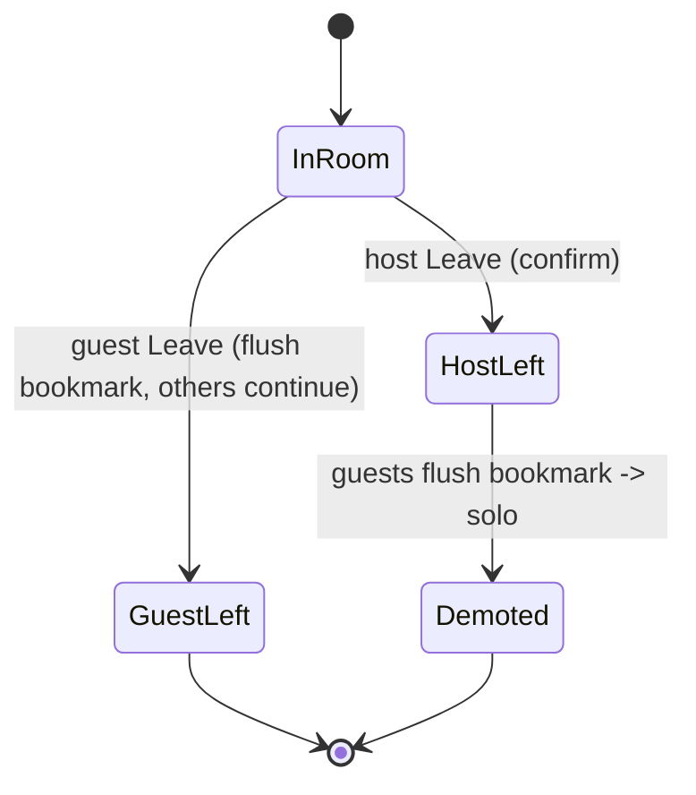

### H. Host gone for real (kill / force-stop / grace expired)

- Guests: `HostLost` after grace → demote. Flush bookmark. Solo from
  here. Link dead.
- Flap inside grace: local `Reconnecting`. Do not demote, do not
  write 0, do not emit controls from a dead socket.
- Host relaunch: **new** room. Do not resurrect the old bookmark as
  if the party continued.

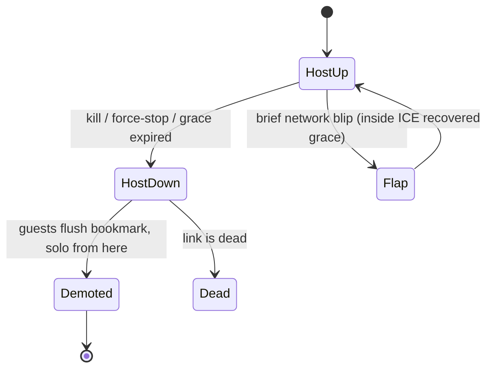

### I. Movie ended

Room can sit paused at duration (OPEN vs auto-end). Bookmark may mark
finished (≥95% already used by Continue Watching). Do not demote just
because credits rolled.

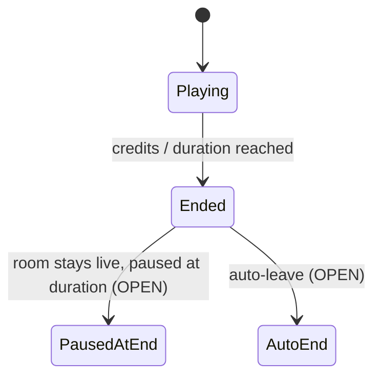

### J. Phone call / headphones / rotation

Local audio focus / Surface. Default: **do not** pause the room
(OPEN in flows doc). Rotation = rebind Surface to same store position.

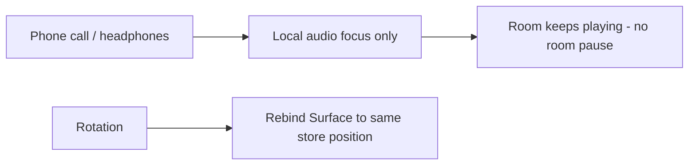

---

## 4. How this hits the rest of the app

| Surface | Reads | Must not |
|---|---|---|
| Home Continue Watching | Bookmark only | Interpret a live room; show 0 from a released player |
| Detail pill | Pool by `itemHash` | Create a second room by accident |
| Listing | Pool + each `engine.state` | End a room on row tap |
| Notification / FGS | Pool size; deep link Listing or single Player | Drive the slider |
| Solo Play | VLC + bookmark | Start FGS |
| WT Player | `engine.state` + local slider | Poll released VLC; `onProgress` while session live |
| Join sheet | Handshake errors | Demote others |

---

## 5. Bookmark writes (the clash)

**Rule:** bookmark is a copy of *this device’s viewing position for
that item*, not a replica of sync protocol.

| Mode | Writer | Source | When |
|---|---|---|---|
| Solo | Player screen | VLC | Periodic + dispose |
| In a room | **FGS only** | `engine.state.positionMs` | Periodic (~heartbeat) + Leave/HostLost flush |
| Headless in a room | FGS | store (virtual clock) | Same |
| Just left / demoted | One flush, then solo writer if they keep watching | store, then VLC | Once |

Never: screen `onProgress` **and** FGS for the same session.  
Never: dispose-after-Back reading VLC.  
Never: lobby position 0 overwriting a real bookmark.  
Never: `seq` in SQLite.

Guest join: don’t write bookmark until playing in the room (or on
Leave). Their old 20:00 solo bookmark stays until they actually watch
with the party.

---

## 6. Player vs store (bound vs headless)

```
Bound:    store ←(mirror on success)← VLC     store → network
Headless: store ← virtual clock + remote      store → network
Rebind:   VLC ← store
Bookmark: SQLite ← store (WT) or VLC (solo)
Slider:   local until scrub-end → store
```

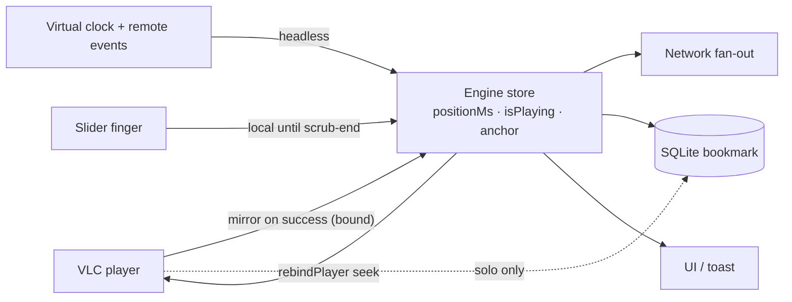

If VLC throws after release, ignore it. The store already knows.

---

## 7. Network vs store

Signaling reachability (invite IP, relay, ZeroTier) is **not** room
clock. STUN is **not** the invite. Failed ICE is local `FailedP2P`.
Only host-dead-past-grace changes global membership for everyone.

Reconnect inside grace: resync from join-ack snapshot into **this**
engine store. Don’t HostLost. Don’t write bookmark 0.

---

## 8. What to implement against (order)

1. **Engine is the only room clock** (`StateFlow`). Session is a lens.
   `heartbeatTick` writes the store. Session snapshot/`refreshState`
   goes away.
2. **FGS copies store → bookmark** for every live session. Player
   `onProgress` only if `session == null`.
3. **WT Player collects the store**; slider is local until end.
4. **VLC latch** for resume-seek vs live scrub — separate.

Until (1)+(2), Back will keep freezing the toast and/or smearing 0
into Continue Watching, no matter how many copies you delete in the UI.
